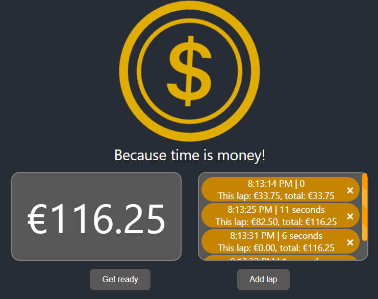

# 💰Coin Counter💰

> Live version over at [studio stoy](https://coincounter.studiostoy.nl).

Hi there! If you want the Quick 'n Dirty intro, [see here](#quick-n-dirty)

Otherwise, enjoy [Cave Johnson's](https://en.wikipedia.org/wiki/Cave_Johnson_(Portal)) ~~rant~~ introduction of the Coin Counter.

___

- Are you tired of slogging through mountains of mundane tasks like some kind of unfortunate desk-bound Olympian?
- Do you crave a monetary carrot dangling in front of your nose, urging you to rise above the sea of mediocrity?
- Are you an aspiring millionaire or a penny-pincher on the brink of a financial revolution?

**If the above applies to you, then listen up, because we've got the answer you've been waiting for!**

Welcome, all you monetary-focused bean counters, to the spectacular world of **Coin Counter**! This ain't your run-of-the-mill mundane accountancy application, Oh no! It's a glorious symphony of capitalism and productivity, designed to keep those gears turning while you rake in the dough!

Say goodbye to your mediocre existence and hello to the life of a monetarily stimulated titan! With the **Coin Counter**, you're not just some ordinary war hero, no sir! You're a profit-pursuing, number-crunching, task-conquering dynamo!

Besides, who needs peace and tranquility when you can have constant reminders of your financial inadequacy?

Cave Johnson, we're done here.

___

## 💰Quick 'n Dirty💰

With the Coin Counter, you can:
- view how much you earn in real time
- The real time count pauses when you have your breaks
- Feast your eyes upon an epic interface
- Set laps to see the amount you made within a time frame
- Enjoy Cave Johnson textually screaming at you again

2023 [Studio Stoy](https://studiostoy.nl)
